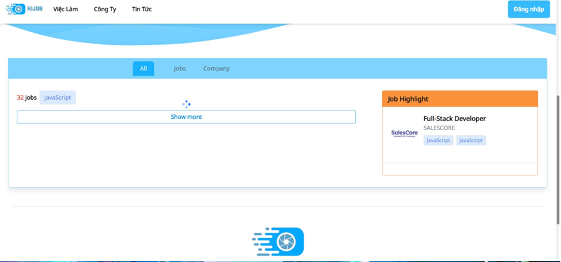

<h1 align="center">
  <br>
  <a href="http://www.amitmerchant.com/electron-markdownify"></a>
  <br>
	HIJOB WEBSITE TÌM KIẾM VIỆC LÀM
  <br>
</h1>

<h4 align="center">Một website được xây dựng để tìm kiếm việc làm cho ngành công nghệ thông tin.</h4>

<p align="center">
  <a href="https://badge.fury.io/js/electron-markdownify">
    
  </a>
  <a href="https://gitter.im/amitmerchant1990/electron-markdownify"></a>
  <a href="https://saythanks.io/to/bullredeyes@gmail.com">
      
  </a>
  <a href="https://www.paypal.me/AmitMerchant">
    
  </a>
</p>

<p align="center">
  <a href="#tinh-nang-chinh">Tính năng chính</a>•
  <a href="#cach-su-dung">Cách sử dụng</a> •
  <a href="#tai-xuong">Tải xuống</a> •
  <a href="#nguon">Nguồn</a> •
  <a href="#giay-phep">Giấy phép</a>
</p>


<span id="tinh-nang-chinh"></span>
## Tính năng chính

* Đăng nhập

* Đăng ký

* Tìm kiếm việc làm

* Ứng tuyển

* Theo dõi việc làm

* Quản lý thông tin


* Tuyển dụng

* Quản lý đơn ứng tuyển

* Quản trị hệ thống


<span id="cach-su-dung"></span>
## Cách sử dụng
To clone and run this application, you'll need [Git](https://git-scm.com) and [Node.js](https://nodejs.org/en/download/) (which comes with [npm](http://npmjs.com)) installed on your computer. From your command line:

```bash
# Clone this repository
$ git clone https://github.com/AVG-Team/HiJob-AVG.git

# Go into the repository
$ cd ./HiJob-AVG/website

# Install dependencies
$ npm install

# Run the front-end
$ npm run dev
```

> **Note**
> Trước tiên phải chạy phần Backend
>

<span id="tai-xuong"></span>
## Tải xuống

Chưa cập nhật

<span id="nguon"></span>
## Nguồn

This software uses the following open source packages:

- [Spring Boot](https://spring.io/projects/spring-boot)
- [Node.js](https://nodejs.org/)
- [ReactJS](https://react.dev/)
- [MUI](https://mui.com/)
- [Ealastic Search](https://www.elastic.co/elasticsearch)
- [Google Recaptcha](https://developers.google.com/recaptcha/)

<span id="giay-phep"></span>
## License

MIT

---

> GitHub [@AVG-Team](https://github.com/AVG-Team) &nbsp;&middot;&nbsp;


